# Mê Cung Tkinter nhóm 3
## 1. Cấu trúc dự án

```text
├── assets
│   ├── goal.png
│   ├── player.png
│   ├── wall.png
├── core
│   ├── maze_generator.py
├── helpers
│   ├── algorithms
│   │   ├── Nhom 1
│   │   │   ├── bfs.py
│   │   │   ├── dfs.py
│   │   │   ├── ids.py
│   │   ├── Nhom 2
│   │   │   ├── astar.py
│   │   │   ├── greedy.py
│   │   │   ├── ucs.py
│   │   ├── Nhom 3
│   │   │   ├── beam.py
│   │   │   ├── hill_climbing.py
│   │   │   ├── simulated_annealing.py
│   │   ├── Nhom 4
│   │   │   ├── anchor_search.py
│   │   │   ├── and_or_search.py
│   │   │   ├── no_observation.py
│   │   ├── Nhom 5
│   │   │   ├── AC-3.py
│   │   │   ├── backtracking.py
│   │   │   ├── forward_checking.py
│   │   ├── Nhom 6
│   │   │   ├── anpha-beta.py
│   │   │   ├── minimax.py
│   │   │   ├── Negamax.py
│   ├── algorithm_names.py
│   ├── loader.py
├── ui
│   ├── controls_frame.py
│   ├── maze_app.py
│   ├── maze_canvas.py
│   ├── random_walls_toggle.py
│   ├── sidebar.py
│   ├── start_position_input.py
├── video
│   ├── ac3.mp4
│   ├── andchor.mp4
│   ├── and_or.mp4
│   ├── A_star.mp4
│   ├── backtrack.mp4
│   ├── beam.mp4
│   ├── bfs.mp4
│   ├── dfs.mp4
│   ├── fc.mp4
│   ├── greedy.mp4
│   ├── hill.mp4
│   ├── ids.mp4
│   ├── minimax.mp4
│   ├── negamax.mp4
│   ├── no_ob.mp4
│   ├── sa.mp4
│   ├── ucs.mp4
├── .gitignore
├── app.py
├── config.py
├── README.md
├── show-tree.ps1
```

## 2. Yêu cầu hệ thống

* **Python** 3.8+ (khuyến nghị 3.10 trở lên)
* **Pip** để cài thư viện
* Các thư viện:

  * **CustomTkinter** (GUI)
  * **CTkMessagebox** (thông báo cho GUI)
  * **Pillow** (xử lý ảnh PNG)

## 3. Cài đặt và chạy

```bash
git clone https://github.com/Peterdir/ProjectAI/
pip install pillow customtkinter
pip install CTkMessagebox
```

Chạy ứng dụng:

* **Windows (PowerShell / CMD):**

```powershell
python .app.py
```

* **macOS / Linux:**

```bash
python3 app.py
```

* **VS Code:** mở thư mục dự án → mở `app.py` → Run (hoặc Code Runner `Ctrl+Alt+N`).

> **Lưu ý:** Chạy từ **thư mục gốc** của dự án để đảm bảo đường dẫn `assets/*.png` load đúng.

## 4. Tính năng chính

* Giao diện Tkinter trực quan với ảnh nhân vật (`player.png`), đích (`goal.png`) và tường (`wall.png`).
* Điều khiển người chơi bằng **phím mũi tên** hoặc **WASD**.
* Nút **Show Solution**: hiển thị đường đi ngắn nhất (theo thuật toán chọn).
* Nút **Reset**: đưa người chơi về vị trí ban đầu.
* Tùy chọn **Grid lines** để bật/tắt lưới.
* Hỗ trợ nhiều **thuật toán tìm đường**: BFS, DFS, DLS, IDS, UCS, A\*…
* Menu chọn thuật toán tự động load từ thư mục `helpers/algorithms`.
* Tạo tường ngẫu nhiên 
## 5. Các tệp quan trọng

* `config.py`: cấu hình mê cung (`ROWS`, `COLS`, `CELL_SIZE`, `START`, `GOAL`, `MAZE`, màu sắc…).
* `helpers/algorithms/[Tên nhóm]*.py`: mỗi file chứa một thuật toán tìm đường (`find_path`).
* `helpers/loader.py`: tự động load thuật toán theo tên.
* `ui/maze_canvas.py`: vẽ mê cung, người chơi, và xử lý sự kiện.
* `ui/sidebar.py`: menu chọn thuật toán.
* `ui/controls_frame.py`: nút Show Solution và Reset.
* `ui/random_walls_toggle.py`: nút tạo tường ngẫu nhiên.
* `ui/start_position_input.py`: nút nhập vị trí ban đầu.
* `ui/app.py`: giao diện Tkinter, vẽ mê cung, người chơi, và xử lý sự kiện.
* `core/maze_generator.py`: tạo mê cung ngẫu nhiên.
* `video`: video demo thuật toán.

## 6. Mô phỏng thuật toán

### Nhóm 1: Tìm kiếm không có thông tin
* Breadth-First Search [BFS](video/bfs.mp4)
 [](https://raw.githubusercontent.com/Peterdir/ProjectAI/main/video/bfs.mp4)

* Depth-First Search [DFS](video/dfs.mp4)
[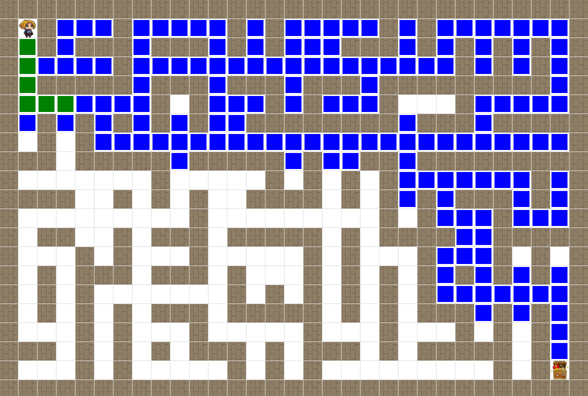](https://www.youtube.com/watch?v=a7o1QR4db7A)
* Iterative Deepening DFS [IDS](video/ids.mp4)
[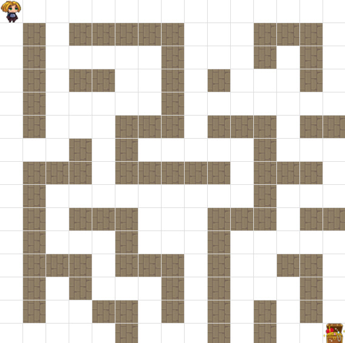](https://www.youtube.com/watch?v=y2_77J-UUF0)
### Nhóm 2: Tìm kiếm có thông tin
* Uniform Cost Search [UCS](video/ucs.mp4)
[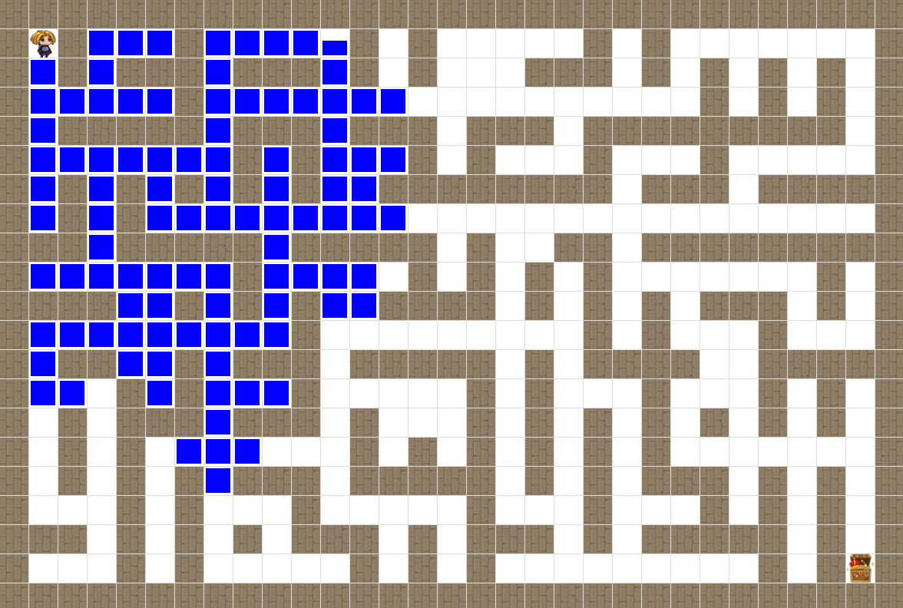](https://www.youtube.com/watch?v=XQOEQzFJ0J8)
* Greedy Best-First Search [Greedy](video/greedy.mp4)
[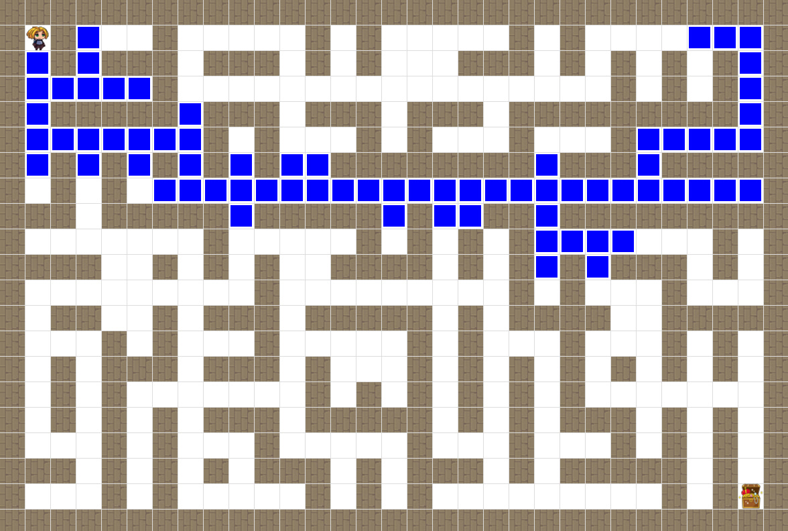](https://www.youtube.com/watch?v=5n4yFOvHwG8)
* A* Search [A*](video/astar.mp4)
[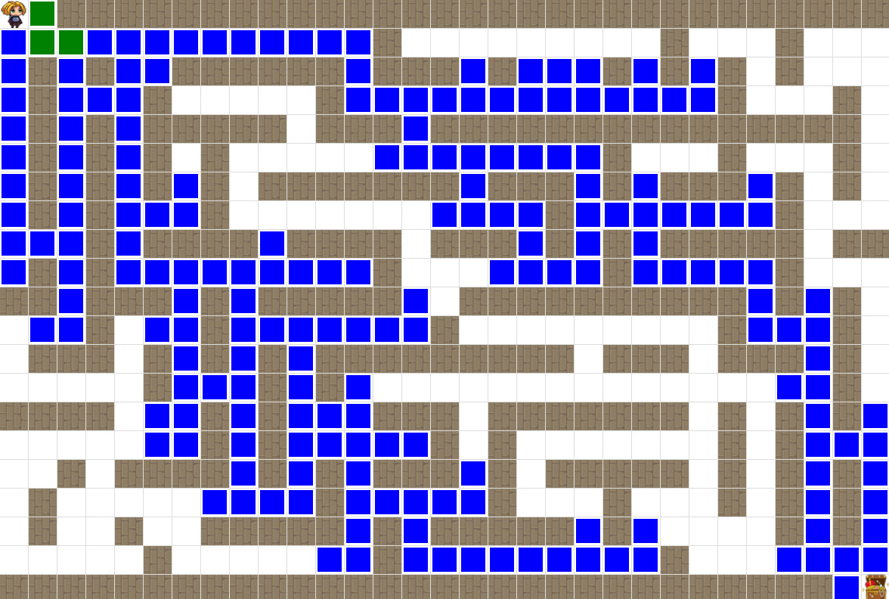](https://www.youtube.com/watch?v=-dSj1eJg3g8)

### Nhóm 3: Tìm kiếm tối ưu hóa
* Beam Search [Beam](video/beam.mp4)
[](https://www.youtube.com/watch?v=-YWgv18ILjM)
* Hill Climbing [Hill](video/hill.mp4)
[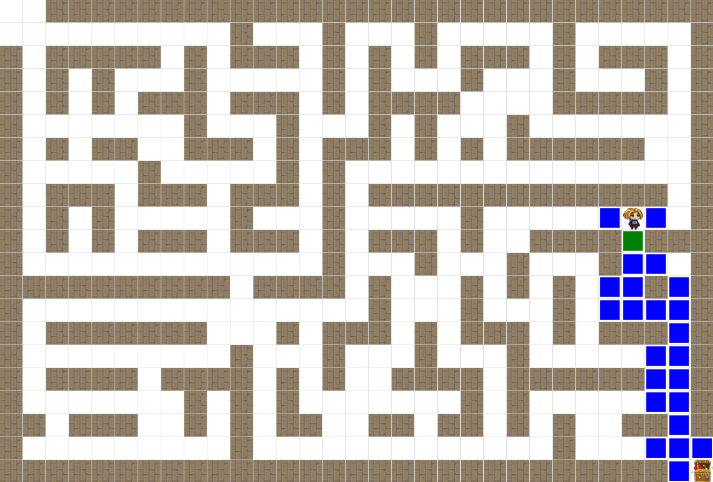](https://www.youtube.com/watch?v=tnEJdaJVpwg)
* Simulated Annealing [Simulated](video/simulated.mp4)
[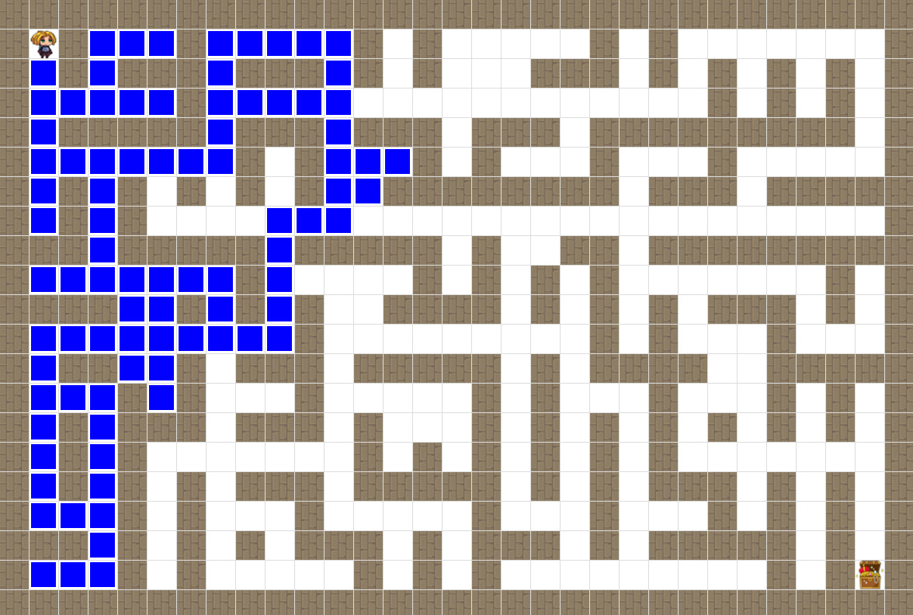](https://www.youtube.com/watch?v=9q9sUCsdJUI)

### Nhóm 4: Tìm kiếm dựa trên mức độ quan sát /xác định của môi trường
* Anchor Search [Anchor](video/anchor.mp4)
[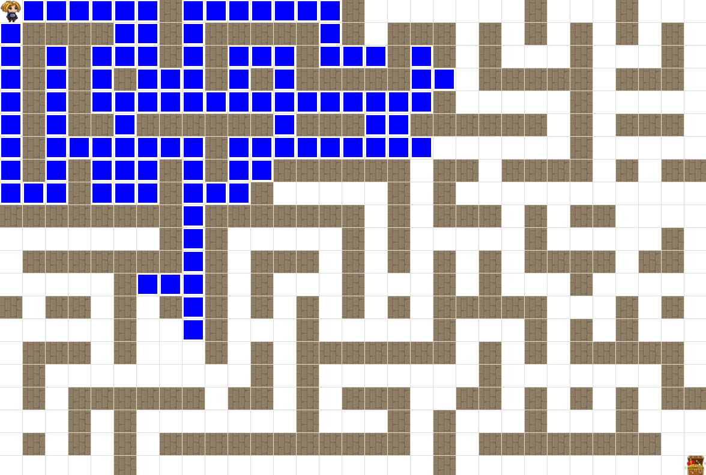](https://www.youtube.com/watch?v=Edh7FfOdwbY)
* AND-OR Search [AND-OR](video/and_or.mp4)
[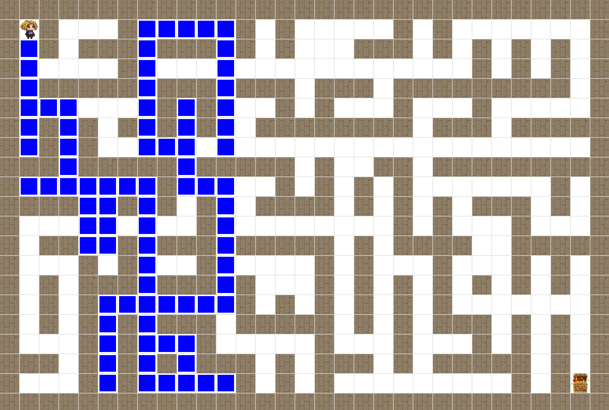](https://www.youtube.com/watch?v=bCGtLPW-qgU)
* No Observation [No-Observation](video/no_ob.mp4)
[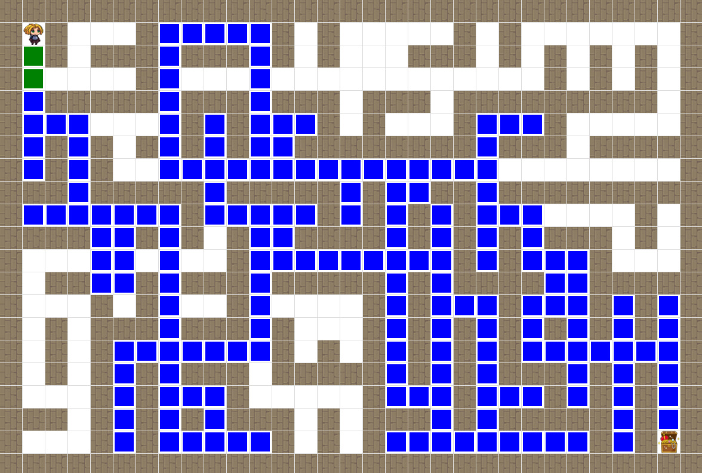](https://www.youtube.com/watch?v=UEIL9LKo8g8)

### Nhóm 5: Tìm kiếm dựa trên thông tin ràng buộc
* AC-3 [AC-3](video/ac3.mp4)
[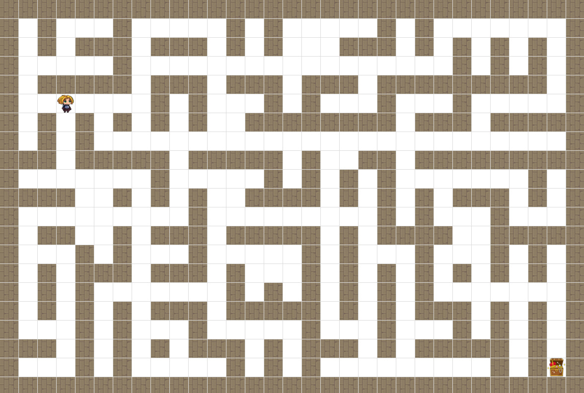](https://www.youtube.com/watch?v=Rde7wIof2kk)
* Backtracking [Backtracking](video/backtrack.mp4)
[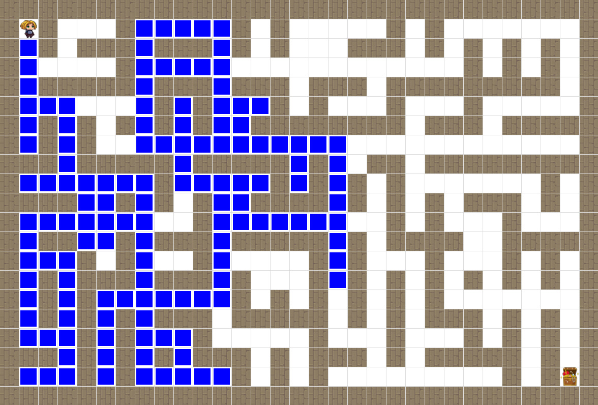](https://www.youtube.com/watch?v=rcbGf-vI-F4)
* Forward Checking [Forward Checking](video/fc.mp4)
[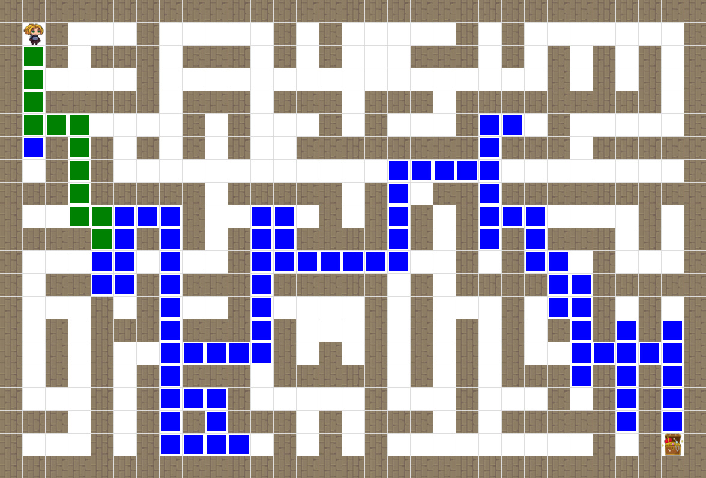](https://www.youtube.com/watch?v=8yG5f7ZGfk8)

### Nhóm 6: Tìm kiếm đối kháng
* Alpha-Beta Pruning [Alpha-Beta](video/anpha-beta.mp4)
[](https://www.youtube.com/watch?v=rcbGf-vI-F4)
* Minimax [Minimax](video/minimax.mp4)
* Negamax [Negamax](video/negamax.mp4)


## 7 Mô tả giao diện

### Mô tả chính

Bắt đầu với giao diện chính `app.py` khi chạy nó sẽ có giao diện như này
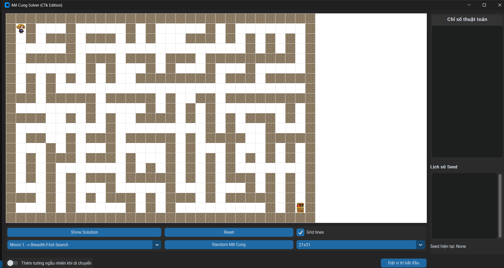
Ở đây nhân vật chính sẽ ở ô bắt đầu của mê cung (ở góc trên bên trái ) và 1 đích đến (ở góc dưới bên phải)
Có thể điều chỉnh tọa độ nhân vật bằng cách click chuột vào ô trên giao diện (đảm bảo các ô phải nằm trên mê cung)
hoặc có thể nhập tọa độ thủ công với nút **Đặt vị trí bắt đầu** nhân vật sẽ di chuyển đến ô đó

Ở trên giao diện có các nút tương tác:
- **[Nhóm thuật toán và thuật toán]** chẳng hạn như **Nhom 1 → Breadth-First Search**, được phép nhấn vào nút OptionMenu này để chọn các nhóm thuật toán khác
- **[Grid lines]** Nhấn vào nút button này để bật/tắt lưới trên mê cung (sẽ thấy được mê cung 1 cách trực quan)
- **[Show Solution]** Nhấn vào nút button này để hiện thị đường đi theo thuật toán đã chọn
- **[Reset]** Nhấn vào nút button này để reset lại mê cung
- **[Random Mê Cung]** Nhấn vào nút button này để tạo mê cung ngẫu nhiên theo kích thước đã được setting sẵn (mặc định là mê cung có kích thước `21x31`)
- Chỉnh kích thước mê cung bằng cách nhấn vào OptionMenu mặc định `21x31`
- Toggle **Thêm tường ngẫu nhiên khi di chuyển**: Tạo tường trong mê cung làm khó thuật toán
- Hai bảng nhỏ :
  - **Chỉ số thuật toán**: Những chỉ số chính của thuật toán chẳng hạn như **Steps** (Số bước đi), **Visited** (Số ô đã thăm), **Time** (Thời gian thực hiện thuật toán),...
  - **Lịch sử Seed**: Lịch sử các seed đã được tạo ra (Tương tác thực trên Seed để thay đổi mê cung)

### Các thông báo phát sinh

  - **Không thể thoát thuật toán khi đang chạy**: 
  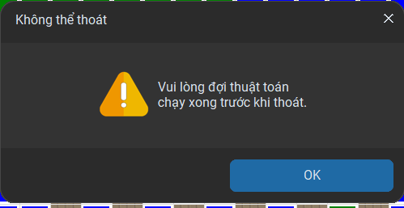
  - **Hoàn thành thuật toán**: 
  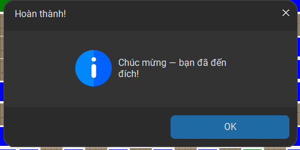
  - **Không tìm thấy đường đi**: 
  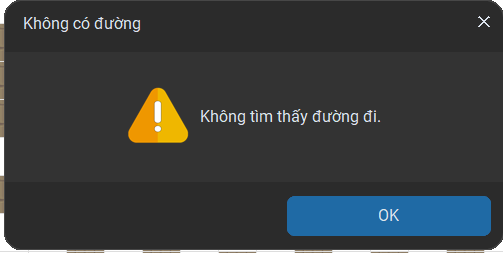
  - **Xác nhận thoát app**: 
  


---

## Liên hệ

Nếu có thắc mắc về code, bạn có thể liên hệ nhóm chúng tôi qua:

### Thành viên nhóm

#### 1. Đặng Minh Tài
<p align="center">
  <a href="mailto:dmt826321@gmail.com"></a>
  <a href="https://facebook.com/tamidanopro"></a>
  <a href="https://github.com/dangminhtai"></a>
</p>

#### 2. Trần Minh Trọng Nhân
<p align="center">
  <a href="mailto:tranminhtrongnhan22072005@gmail.com"></a>
  <a href="facebook.com/tran.nhan.407057"></a>
  <a href="https://github.com/sibula227"></a>
</p>

#### 3. Lâm Khánh Duy
<p align="center">
  <a href="mailto:lamkhanhduy123kg@gmail.com"></a>
  <a href="https://www.facebook.com/duy.lamkhanh.399"></a>
  <a href="https://github.com/Peterdir"></a>
</p>

> Thả 1 star ⭐ nếu cảm thấy dự án này hữu ích nhé!

